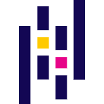
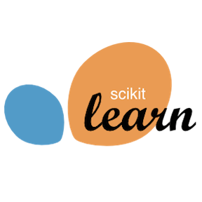

## Hey there, this is Divy 👋

Aspiring 🎨 **designer**, 💻 **developer**, 🔭 **researcher**, and 🧠 **learner**

 

### Welcome to My World 🙌

- 👨🏻‍💻 Working on two **`Covid`** related medical projects 😷
- 💡 Sharpening my problem solving skills by solving some **[`Advent of Code`](https://github.com/divykj/AdventOfCode)** 🎄 (P.S. please try this, this is the best place to develop your problem solving skills, can't recommend it enough 🙈)
- 🌱 Learning **`rust`**, take a look at **[`Exercism (Rust Track)`](https://github.com/divykj/ExercismRust)** and **[`dvOS`](https://github.com/divykj/dvOS)** 🙃 (I'm in love with this language 😍)
- 👯 Looking to collaborate on some live projects in **`ai/ml(in python)`** and **`ui/ux(in react)`** (or just any plain old coding project, I just want to code 🤷)
- 🏗 Actively developing and maintaining my library, **[`importit`](https://github.com/divykj/importit)** (check it out, and show some love ☺)
- 📫 Available at **`dkj@somaiya.edu`**, don't hesitate to reach out, I'm a cool guy 😉 (no seriously, not kidding, just hit me up 🤙🏻)
- 🏆 Winner of **`SIH 2020 (PSCode: MS450)`**, which is `"World's Biggest Open Innovation Model"` (so now I have the bragging rights, but thanks to my amazing team `int elligent;`, and the mentors 🙌🏻)
- ⚡ Other Interests: **`⚽ Football | 🔵🔴 Barça | 👽 Messi`**

Yes, I know, I am very talkative, but... That's part of my charm 😎😂

 

### Stats

 
 

### Tech Stack

  

    <h4>Setup</h4>
    

      
      
      
      
    

  

  

    <h4>Core Languages</h4>
    

      
      
      
      
    

  

  

    <h4>Web Development</h4>
    

      
      
      
      
    

  

  

    <h4>Data Science</h4>
    

      
      
      
      
    

  

